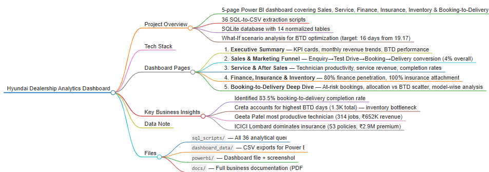
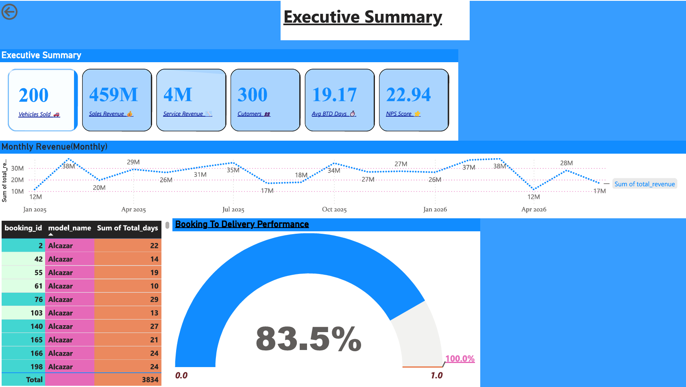
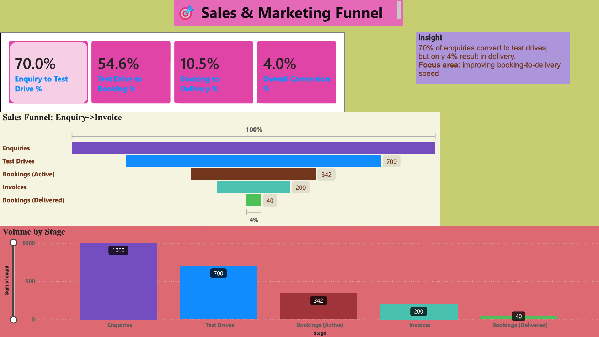
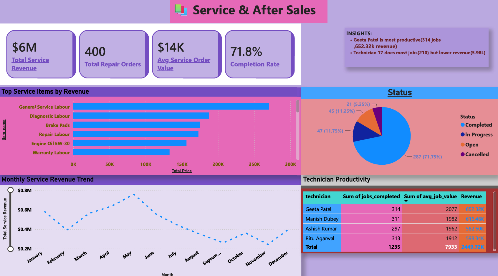
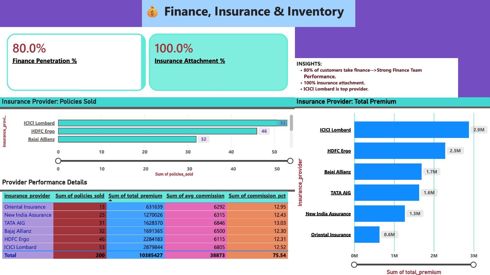
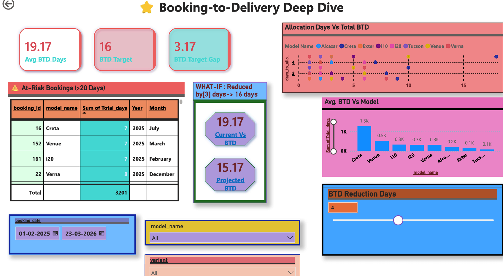

<div align="center">

# 🚗 End-to-End Hyundai Dealership Analytics
### From Fragmented Data to Unified Business Intelligence

<p align="center">


</p>

An enterprise-scale Business Intelligence project that transforms fragmented dealership data into actionable insights through SQL, Python, and Power BI.


<p align="center">
  
</p>

</div>

---

# 📑 Table of Contents

- Project Overview
- Business Workflow
- Technology Stack
- Project Architecture
- Dashboards
- Key KPIs
- Folder Structure
- Business Insights
- Future Improvements
- Screenshots
- Author

---

# Project Overview

This project simulates a real-world Hyundai dealership analytics platform by integrating operational data from multiple departments into a centralized reporting solution.

The project follows the complete analytics lifecycle:

- Data Collection
- Data Cleaning
- Database Design
- SQL Analytics
- KPI Development
- Dashboard Development
- Business Intelligence

---

# Business Workflow

```text
Customer Enquiry
        │
        ▼
Test Drive
        │
        ▼
Booking
        │
        ▼
Vehicle Allocation
        │
        ▼
Invoice
        │
        ▼
Vehicle Delivery
        │
        ▼
Insurance
        │
        ▼
Finance
        │
        ▼
Service
        │
        ▼
Customer Feedback
```

---

# Tech Stack

| Tool | Purpose |
|-------|---------|
| Python | Data Processing |
| SQL | Analytics & Queries |
| SQLite | Database |
| Power BI | Dashboards |
| VS Code | Development |
| Excel | Data Validation |

---

# Project Architecture

```text
Raw Data
     │
     ▼
Python Cleaning
     │
     ▼
SQLite Database
     │
     ▼
26 SQL Analytics Queries
     │
     ▼
CSV Reports
     │
     ▼
Power BI Dashboards
     │
     ▼
Business Insights
```

---

# Dashboards

## Executive Dashboard

- Revenue Overview
- Booking-to-Delivery Analysis
- Sales KPIs
- Revenue Trend
- Customer Metrics

---

## Sales & Marketing Funnel

- Sales Funnel
- Lead Conversion
- Consultant Performance
- Source Analysis

---

## Sales After Service

- Vehicle Availability
- Stock Aging
- Inventory Value
- Model-wise Analysis

---

## Finance, Insurance & Inventory

- Service Revenue
- Repair Orders
- Technician Productivity
- Customer Satisfaction

---

## Booking_to_Delivery Deep Dive

- Customer Segmentation
- NPS Score
- Demographics
- Feedback Analysis

---

# Key KPIs

✔ Revenue

✔ Vehicles Sold

✔ Lead Conversion Rate

✔ Booking-to-Delivery Days

✔ Inventory Turnover

✔ Service Revenue

✔ Customer Satisfaction

✔ Net Promoter Score (NPS)

✔ Consultant Performance

✔ Dealer Fulfilment Rate

---

# Repository Structure

```text
End-To-End-Hyundai-Dealership-Analytics/

│
├── dashboard/
├── dashboard_data/
├── Data/
├── docs/
├── images/
│   ├── executive_dashboard.png
│   ├── sales_dashboard.png
│   ├── inventory_dashboard.png
│   ├── service_dashboard.png
│   └── customer_dashboard.png
│
├── sql/
├── sql_queries/
│
├── hyundai_dealership.db
├── README.md
├── requirements.txt
└── .gitignore
```

---

# Business Insights

- Identified delivery bottlenecks affecting booking-to-delivery timelines.
- Monitored sales conversion across the dealership pipeline.
- Tracked inventory availability and stock aging.
- Evaluated consultant performance using operational KPIs.
- Built executive dashboards for data-driven decision-making.

---

# Screenshots

## Executive Dashboard



## Sales & Marketing Funnel



---

## Sales After Service



---

## Finance, Insurance & Inventory



---

## Booking_to_Delivery Deep Dive



---

# Future Improvements

- SQL Server Integration
- Automated ETL Pipelines
- Power BI Service Deployment
- Real-Time Dashboard Refresh
- Machine Learning Sales Forecasting
- Customer Churn Prediction

---

# Skills Demonstrated

- Data Analytics

- SQL

- Python

- Power BI

- Business Intelligence

- Data Visualization

- Dashboard Design

- Data Cleaning

- Data Modeling

- KPI Development

- Business Analysis

---

# Author

**Jigyasa Singh**

B.Tech Computer Science (Data Science)

Data Analyst | Business Intelligence Enthusiast

LinkedIn: https://www.linkedin.com/in/jigyasa-singh-36b18736b/

GitHub: https://github.com/Jigyasa02
Email:  jigyasas355@gmail.com

---

If you found this project useful, consider giving it a ⭐ on GitHub.